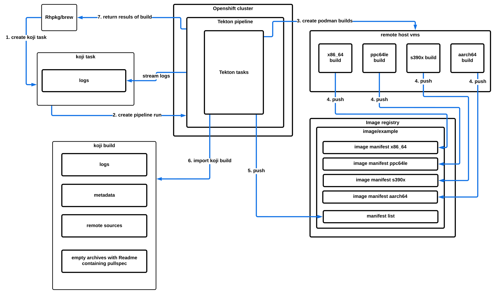
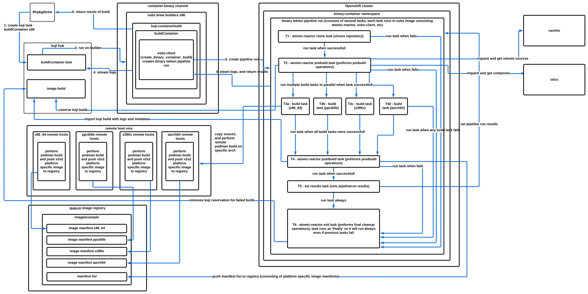
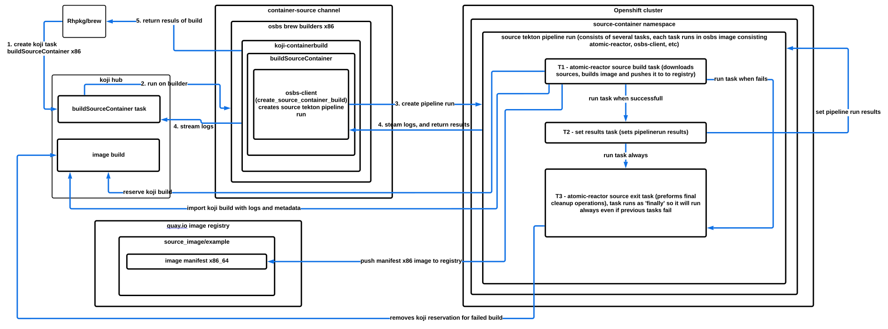

.. _`build process`:

Understanding the Build Process
===============================

General workflow
----------------

OSBS build starts either with fedpkg or koji command. It creates buildContainer/buildSourceContainer
task in koji hub. When osbs koji builders have free capacity, they will pick up task
and koji-containerbuild plugin will start. It will use osbs-client and call
create_binary_container_build/create_source_container_build,
which will connect to Openshift cluster and create binary/source tekton pipeline run.
Each binary and source tekton pipeline consists of multiple tasks, both of them also have exit task
which runs always regardless of previous tasks success (in finally section of pipeline).
If any task in pipeline fails, all consecutive tasks except those in finally will be skipped.

When koji build is reserved (enabled by default), it will create koji build owned by OSBS,
and later when koji build is imported, owner of the build will change to koji task submitter.

Binary builds are also using set of remote host VMs for each platform, on which actual image build
is performed, binary build task is using podman-remote to execute such builds on them.

OSBS is importing koji build for all but scratch builds.

Binary koji build contains:
    - osbs-build.log (logs from pipeline run)
    - platform specific logs for build task and podman build itself
      (x86_64.log, x86_64-build.log, etc)
    - image archive which contains only README file with the pullspec (additionally
      to koji metadata)
    - for operator bundle builds, archive with operator manifests
    - for builds which use remote sources, json and archive with remote sources

Source koji build contains:
    - osbs-build.log (logs from pipeline run)
    - empty x86_64 image archive with README file with the pullspec

Binary koji task contains:
    - build results
    - logs are streamed during build
        * checkout-for-labels.log (logs from repository cloning on brew builder)
        * osbs-build.log (logs from pipeline run)
        * osbs-client.log (logs from osbs-client)
        * logs from build task for each platform (ppc64le.log, x86_64.log, etc)
    - if there are any user warning there will be user_warnings.log

Source koji task contains:
    - build results
    - logs are streamed during build
        * osbs-build.log (logs from pipeline run)
        * osbs-client.log (logs from osbs-client)
    - if there are any user warning there will be user_warnings.log

Binary pipeline consists of these tasks:
~~~~~~~~~~~~~~~~~~~~~~~~~~~~~~~~~~~~~~~~

- Clone task:
    * Clone git repository with sources

- Prebuild task:
    * Fetch artifacts from lookaside cache if used
    * For flatpak builds, create Dockerfile
    * Resolve final platforms (based on container.yaml and disabled remote hosts)
    * Verify existence and validity of parent images
    * Verify that parent images come from existing koji build
    * Resolve composes, integration with `odcs`_. See :ref:`yum-repositories-odcs-compose`
      for details.
    * For base image builds, create koji image task ("`image-build`_" task to create filesystems
      for all required platforms) and include filesystem to build directory
    * Supply "release" label if it is missing from Dockerfile and also reserve koji build nvr
      in koji
    * Apply automatic and configurable labels in Dockerfile
    * Resolve and fetch remote sources if any requested
    * For operator bundle builds, pin operator digests
    * Generate and add help if required
    * Fetch artifacts from PNC or URLs if requested
    * Generate and add image content manifest
    * Include yum repos, either from explicitly provided repos, or from odcs composes

- Build tasks:
    * Run multiple build tasks based on requested platforms to build for and push images
      in the registry

- Postbuild task:
    * For flatpak builds, create OCI image, and push it to registry
    * Query platform specific images to discover installed RPM packages, used later for compare
      packages and koji metadata
    * For operator bundle builds, fetch and zip operator manifest, used later for importing
      to koji build
    * Compare packages installed in images for all platforms
    * Create a `manifest list`_ object in the registry, grouping together the image manifests
      for all platforms
    * Push floating tags to the registry for a manifest list
    * Import the Koji build
    * Tag the Koji build

- Set results task:
    * Set pipeline run results based on outputs of previous tasks

- Exit task:
    * For failed builds, cancel koji build nvr reservation
    * Send email notifications if required (with default configuration for failed builds)

.. _`image-build`: https://docs.pagure.org/koji/image_build/
.. _`manifest list`: https://docs.docker.com/registry/spec/manifest-v2-2/#manifest-list
.. _`odcs`: https://pagure.io/odcs

Source pipeline consists of these tasks:
~~~~~~~~~~~~~~~~~~~~~~~~~~~~~~~~~~~~~~~~

- Build task:
    * Fetch all sources from binary build (srpms, remote sources, artifacts)
    * Reserve koji build nvr in koji
    * Build source image using `BuildSourceImage`_
    * Tag and push source image to the registry
    * Import the Koji build
    * Tag the Koji build

- Set results task:
    * Set pipeline run results based on outputs of previous tasks

- Exit task:
    * For failed builds, cancel koji build nvr reservation

.. _`BuildSourceImage`: https://github.com/containers/BuildSourceImage

Binary workflow
---------------

Source workflow
---------------

Logging
-------

Logs from builds are made available via osbs-client API,
and clients (including koji-containerbuild) are able to separate
individual task logs out from that log stream using an
osbs-client API method.

Getting logs during build
~~~~~~~~~~~~~~~~~~~~~~~~~

Logs can be streamed from the build via osbs-client API method
``get_build_logs`` and setting ``follow`` and ``wait`` parameters
to ``True``.

These logs are returned in tuple form as ``(task_run_name, log_line)``. Where
``task_run_name`` is the name of the task that generated the log line. The name
of the task will also contain the platform that task is building for if it is a
platform specific task. This can be used to separate the logs by platform.

Getting logs after the build
~~~~~~~~~~~~~~~~~~~~~~~~~~~~

``get_build_logs`` of osbs-client API will return the logs as a dictionary. The
top level keys will be the task name that can also be used to identify platform
specific logs and separate them into platform specific log files.

Encoding issues
~~~~~~~~~~~~~~~

When retrieving logs from containers, the text encoding used is only
known to the container. It may be based on environment variables
within that container; it may be hard-coded; it may be influenced by
some other factor. For this reason, container logs are treated as byte
streams.

When retrieving logs from a build, OpenShift cannot say which encoding
was used. However, atomic-reactor can define its own output encoding
to be UTF-8. By doing this, all its log output will be in a known
encoding, allowing osbs-client to decode it. To do this it should call
``locale.setlocale(locale.LC_ALL, "")`` and the Dockerfile used to
create the builder image must set an appropriate environment
variable::

  ENV LC_ALL=en_US.UTF-8

Example
~~~~~~~

Here is an example Python session demonstrating this interface for streaming::

  >>> server = OSBS(...)
  >>> logs = server.get_build_logs(follow=True, wait=True)
  >>> [(task_run_name, log_line) for task_run_name, log_line in logs]
  [('binary-container-prebuild', '2017-06-23 17:18:41,791 platform:- - atomic_reactor.foo - DEBUG - this is from the pipeline task'),
   ('binary-container-build-x86-64', '2017-06-23 17:18:41,400 atomic_reactor.foo - DEBUG - this is from a build'),
   ('binary-container-build-aarch64', '2017-06-23 17:18:41,400 atomic_reactor.foo - DEBUG - this is from a build'),
   ('binary-container-build-s390x', '2017-06-23 17:18:41,400 atomic_reactor.foo - DEBUG - this is from a build'),
   ('binary-container-build-ppc64le', '2017-06-23 17:18:41,400 atomic_reactor.foo - DEBUG - this is from a build'),
   ('binary-container-postbuild', 'continuation line')]

Note:

- the lines are (Unicode) string objects, not bytes objects

- where the build log line had no timestamp (perhaps the log
  line had an embedded newline, or was logged outside the adapter
  using a different format), the line was left alone

Here is an example Python session demonstrating this interface non-streaming::

  >>> server = OSBS(...)
  >>> logs = server.get_build_logs()
  >>> logs
  {'binary-container-prebuild': {'containerA': '2017-06-23 17:18:41,791 platform:- - atomic_reactor.foo - DEBUG - this is from the pipeline task'},
   'binary-container-build-x86-64': {'containerB': '2017-06-23 17:18:41,400 atomic_reactor.foo - DEBUG - this is from a build'},
   'binary-container-build-aarch64': {'containerC': '2017-06-23 17:18:41,400 atomic_reactor.foo - DEBUG - this is from a build'},
   'binary-container-build-s390x': {'containerD': '2017-06-23 17:18:41,400 atomic_reactor.foo - DEBUG - this is from a build'},
   'binary-container-build-ppc64le': {'containerE': '2017-06-23 17:18:41,400 atomic_reactor.foo - DEBUG - this is from a build'},
   'binary-container-postbuild': {'containerF': 'continuation line'}}

