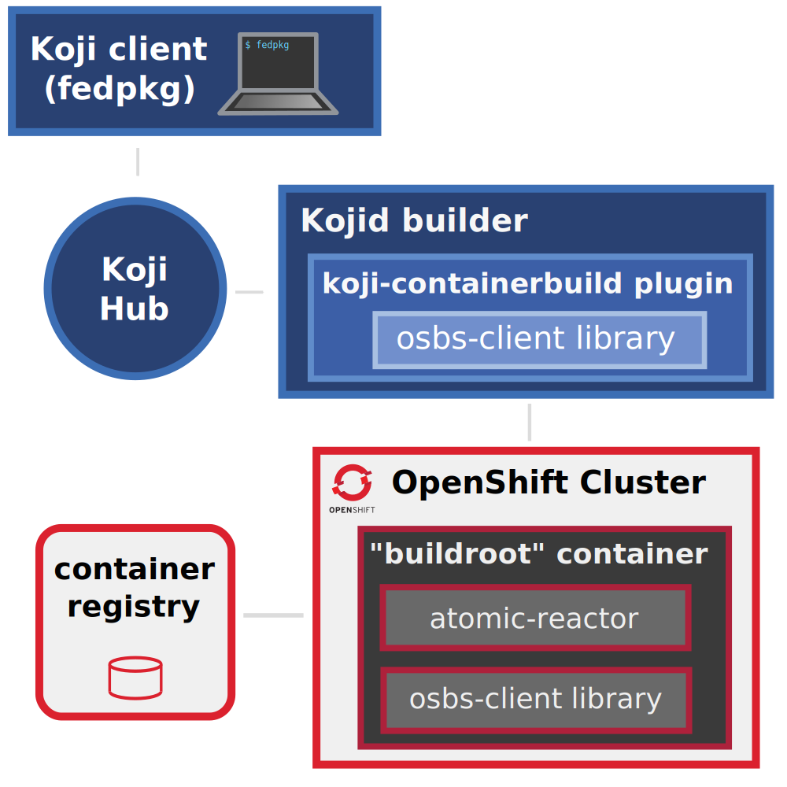

OpenShift Build Service
=======================

.. warning::
  This version is under the development to support Openshift 4 and Tekton pipelines and it's not ready for use.

  For version running on Openshift 3 please visit https://osbs.readthedocs.io/en/osbs_ocp3/ for stable docs.

.. note::
  Required releases of components:
    - osbs-client >= 2.0.0
    - atomic-reactor >= 4.0.0
    - koji-containerbuild >= 1.0.0

OSBS is a collection of tools, workflows and integration points that build and release layered container images.

OSBS hooks into Koji_ with the help of the `koji-containerbuild plugin
<https://github.com/containerbuildsystem/koji-containerbuild>`_, and
uses `OpenShift builds <https://docs.okd.io/3.11/dev_guide/builds/index.html>`_ as Content Generators to produce layered images.

.. _Koji: https://pagure.io/koji

One can start an image build with ``fedpkg``, using the ``container-build``
subcommand:

.. code::

    $ fedpkg container-build

Table of Contents
-----------------

.. toctree::
    :maxdepth: 3

    admins
    users
    build_process
    build_parameters
    contributors
    reference_docs

Indices and tables
==================

* :ref:`genindex`
* :ref:`search`

