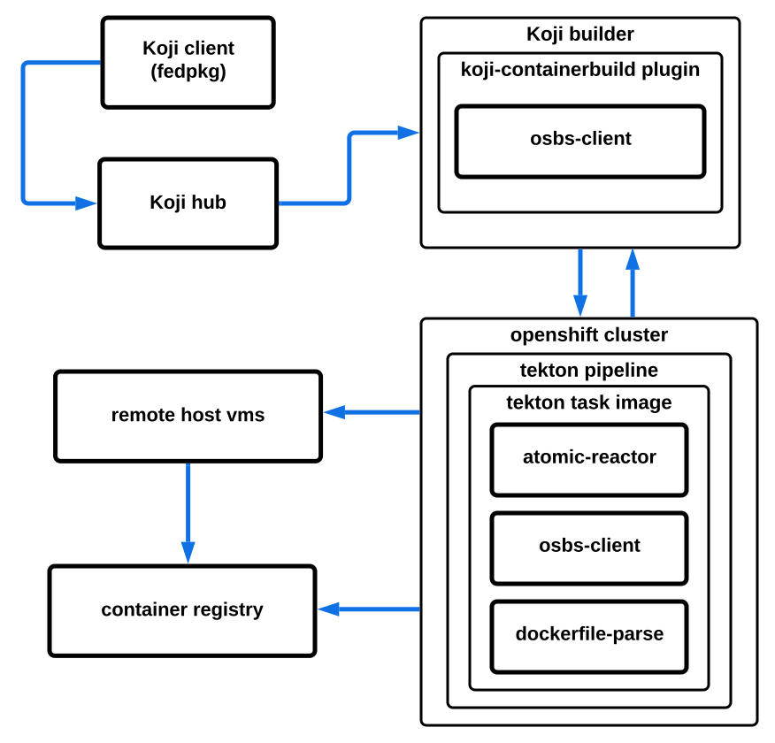

OpenShift Build Service 2
=========================

.. warning::
  This version is for Openshift 4 and Tekton pipelines.

  For version running on Openshift 3 please visit https://osbs.readthedocs.io/en/osbs_ocp3/ .

.. note::
  Required releases of components:
    - osbs-client >= 2.0.0
    - atomic-reactor >= 4.0.0
    - koji-containerbuild >= 1.0.0

OSBS is a collection of tools, workflows and integration points that build and release layered
container images.

OSBS hooks into Koji_ with the help of the `koji-containerbuild plugin
<https://github.com/containerbuildsystem/koji-containerbuild>`_, and
uses `OpenShift tekton pipelines <https://tekton.dev/docs/pipelines/pipelines/>`_ with podman-remote as Content Generators to produce layered images.

.. _Koji: https://pagure.io/koji

One can start an image build with ``fedpkg``, using the ``container-build``
subcommand:

.. code::

    $ fedpkg container-build

Table of Contents
-----------------

.. toctree::
    :maxdepth: 3

    admins
    users
    build_process
    build_parameters
    contributors
    reference_docs

Indices and tables
==================

* :ref:`genindex`
* :ref:`search`

