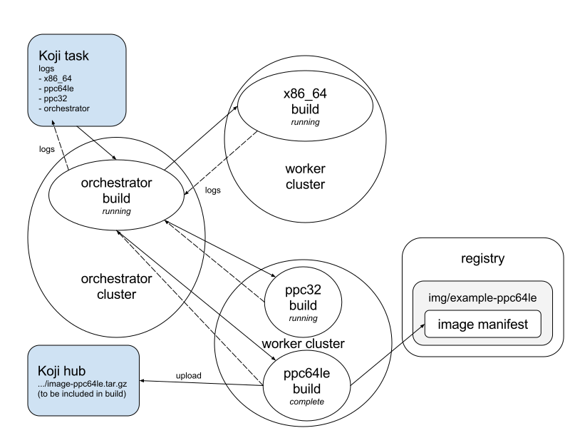
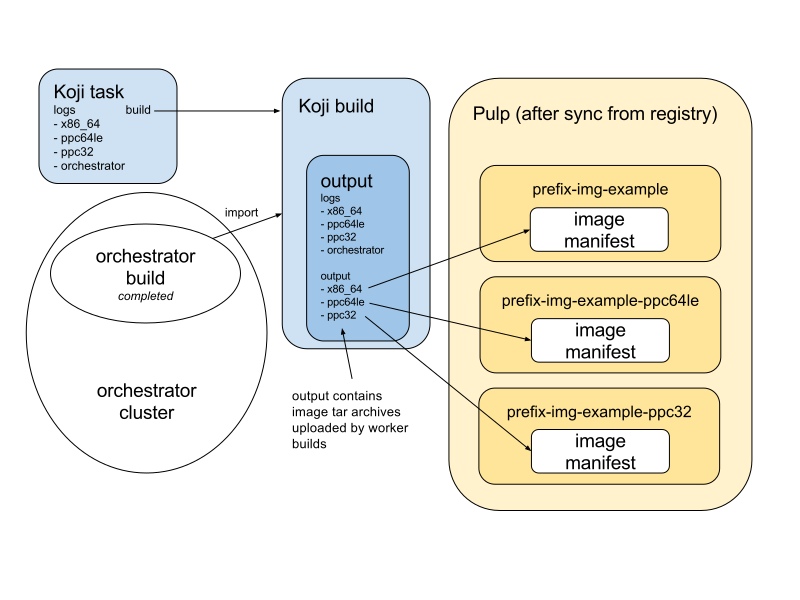

Multi-platform container image builds
=====================================

This is the "future state" description of how container images will be
built for multiple platforms.

A single git commit will be used as the source for building multiple
container images, each suitable for a different platform (CPU
architecture, variant, required CPU features, etc).

To support multi-arch builds, two types of OpenShift Build will be
used:

- *worker builds* which will perform the "docker build" step as
  before (on compute nodes of the appropriate architecture)
- *orchestrator build* which will create and manage the worker builds

The cluster which will run orchestrator builds is referred to here as
the *orchestrator cluster*, and the cluster which will run worker
builds is referred to here as the *worker cluster*.

Note that the orchestrator cluster itself may also be configured to
accept worker builds, so the cluster may be both orchestrator and
worker. Alternatively some sites may want to have complete clusters
for each platform as well as for the orchestration.

Technically, only compute nodes in the required architectures are
needed to perform the "docker build" step. These can be arranged
either in a single mixed-architecture cluster, or with multiple
single-architecture clusters for each architecture, or as a mix of the
two.

Client configuration on the Koji builder will decide which cluster
and/or `node selector`_ is required to perform image builds for each
required platform.

.. _`node selector`: https://docs.openshift.org/latest/admin_guide/managing_projects.html#developer-specified-node-selectors

The orchestrator build will make use of `Server-side configuration for
atomic-reactor`_ to discover which worker clusters to direct builds
to.

If integration with Pulp is used, there will be separate Pulp
repositories for each image and platform, following a naming scheme
yet to be decided. For x86_64 images the repository names will remain
unchanged.

Orchestration required for multi-platform builds
------------------------------------------------

When a new multi-platform build is required, one designated cluster
will always be asked to perform it. This cluster will perform this
using atomic-reactor running in "orchestration" mode, i.e. with a
different set of steps running as plugins:

- For base images, create the base image filesystems for all required
  architectures using Koji
- Orchestrate worker builds on other clusters (or this cluster) as
  needed; if any worker build fails the orchestrator plugin must also
  fail (but other worker builds should be left to continue); if the
  whole build is cancelled, worker builds will be cancelled
- Collect package content from all builds and compare to ensure common
  components are exactly matching (for RPMs: version-release and
  keys used for signatures)
- Publish Pulp repositories that had content added (if Pulp
  integration is enabled)
- Create a Koji Build (if Koji integration is enabled). Note: no need
  to upload image tar archives as worker builds have done this
- On failure, remove added Pulp content and revert Pulp docker tags
  (if Pulp integration is enabled)
- Update this OpenShift Build with annotations about output,
  performance, errors, worker builds used, etc

The orchestration step will create OpenShift builds for performing the
worker builds. Inside each of these platform-specific OpenShift
builds, atomic-reactor will execute these steps as plugins:

- Make alterations to the Dockerfile, including transforming the
  "FROM" image name and name label into a platform-specific name, as
  well as setting the ``architecture`` label appropriately
- "docker build"
- Squash the image
- Compress the docker image tar archive
- Upload this compressed tar archive to Pulp (if Pulp integration and
  v1 support are both enabled)
- Tag and push the image to the docker registry, using a unique tag
  including the timestamp, ``latest``, $version, $version-$release,
  and any additional tags configured by the image owner
- Sync the image from the docker registry to Pulp but not publish it
  (if Pulp integration is enabled)
- Query the image to discover installed RPM packages
- Upload image tar archive to Koji but do not create a Koji Build (if
  Koji integration is enabled)
- Update this OpenShift Build with annotations about output,
  performance, errors, etc

   During build

   After build

Submitting builds
-----------------

A new optional parameter ``--arches`` will be added to the
``container-image`` subcommand provided by pyrpkg. This will pass the
parameter ``arches`` to the Koji task (implemented by the
``koji-containerbuild`` plugin for Koji).

When supplied, this parameter overrides the default set of
architectures to build for, which comes from the Koji build target.

Authentication
--------------

The orchestrator cluster will have a service account (with edit role)
created for use by Koji builders. Those Koji builders will use the
service account's persistent token to authenticate to the orchestrator
cluster and submit builds to it.

Since the orchestrator build initiates worker builds on the worker
cluster, it must have permission to do so. A service account should be
created on each worker cluster in order to generate a persistent
token. This service account should have edit role. On the orchestrator
cluster, a secret for each worker cluster should be created to store
the corresponding service account tokens. When osbs-client creates the
orchestrator build it must specify the names of the secret files to be
mounted in the BuildConfig. The orchestrator build will extract the
token from the mounted secret file.

Building base images
--------------------

The atomic-reactor ``add_filesystem`` plugin is responsible for
creating a Koji image-build task and streaming the output of that task
into the initial container image layer. It does this with the aid of
an ``image-build.conf`` file in the git repository.

For multi-platform builds the Koji image-build task needs to be
started by the orchestrator build and configured to build for multiple
architectures. This Koji task will have multiple output files, one for
each architecture. The ``image-build.conf`` file in the git
repository should be changed so that it no longer specifies any
architecture, as atomic-reactor will supply this field.

Having the orchestrator build do this step, which mostly involves
waiting for the Koji task to finish, results in better (more accurate)
resource allocation. Orchestrator builds will have slimmer resource
requests than those of worker builds.

After the Koji task has finished, the worker builds then need to be
instructed to take their input from a specific output of that
task. The ``add_filesystem`` plugin will need changes for this:

- it will need a parameter to tell it to create a multi-platform
  image-build task and not stream the output of that task. This
  parameter will be set for the orchestrator build.

- it can already be told to take its input from the output of a
  specific Koji task, but will need to be able to decide which
  particular task output file is required by parsing the output
  filenames and looking for the platform name. This parameter will be
  set for the worker build.

Excluding platforms
-------------------

Some container images will need to be built for multiple platforms but
some may not.

The ``osbs.conf`` file will specify the full list of platforms for which
worker builds should be created. This list of platforms can be reduced
in three ways:

- Including platforms:

  * the set of platforms an image is built for is determined by the
    Koji build tag for the Koji build target

  * Container image builds can be submitting with a parameter
    ``--arches``, overriding the set of platforms specified by the Koji
    build target, in the same way as for building RPM packages

- Excluding platforms:

  * a git repository file ``exclude-platform`` can be used to list
    platforms which this image should not be built for

Tagging
-------

There are no changes to the tagging scheme. Each image manifest will
be tagged as before using:

- ``latest``
- $version
- $version-$release
- a unique tag including the timestamp
- any additional tags configured in the git repository

Scratch builds
--------------

There are no changes to how scratch builds are performed, only some
parts of the implementation will move around. Some build steps will be
omitted when performing scratch builds:

- only unique tags will be applied in the worker builds
- the result will not be imported into Koji in the orchestrator build

Streamed build logs
-------------------

When atomic-reactor in the orchestrator build runs its
``orchestrate_build`` plugin and watches the builds, it will stream logs
from those builds and log them again itself with a special prefix
indicating they are logs relating to a particular platform.

Note that there will be a single Koji task with multiple log
outputs. When watching this using ``koji watch-logs <task id>`` the log
output from each worker build will be interleaved. To watch logs from
a particular worker build image owners can use ``koji
watch-logs --log=LOGFILE <task id>``.

Chain rebuilds
--------------

OpenShift Build Triggers, and atomic-reactor plugins dealing with
ImageStreams or triggers, are only applicable to the orchestrator
BuildConfigs. The x86_64 image stream tags (from Pulp's crane, when
Pulp integration is enabled) will be used for triggering builds, and
Pulp repositories will be published by the orchestrator build, not the
worker builds.

Although worker builds will be associated with BuildConfigs for
convenience of grouping historical builds for the same component in
the "console" interface, no worker BuildConfigs will have triggers.

Low priority builds
-------------------

For scratch builds and for triggered rebuilds, node selectors will be
used to restrict the set of nodes which may perform these low-priority
builds. The node selector for doing this will be combined with the
node selector for selecting platform-specific nodes.

Cancellation and failure
------------------------

When a build is canceled in Koji this should be correctly propagated
all the way down to the worker builds:

- koji_containerbuild calls the osbs-client API method to cancel
  the (orchestration) build
- osbs-client calls the OpenShift API method to cancel the
  orchestrator build in OpenShift
- OpenShift sends a signal to atomic-reactor
- atomic-reactor handles this signal by running exit plugins, one of
  which calls the osbs-client API method to cancel each worker build
- Each osbs-client invocation calls the OpenShift API method to cancel
  a worker builder
- Each instance of atomic-reactor handles the signal it gets sent by
  running exit plugins, which perform clean-up operations

In the case of a build for one platform failing, builds for other
platforms will continue. Once all have either succeeded or failed, the
orchestrator build will fail. No content will be available from the
registry.

Client Configuration
--------------------

The osbs-client configuration file format will be augmented with
instance-specific fields ``node_selector``, ``reactor_config_secret``,
``client_config_secret``, and ``token_secrets``, as well as the
platform-specific field ``repository_transform``.

Node selector
~~~~~~~~~~~~~

When an entry with the pattern ``node_selector.platform`` (for some
*platform*) is specified, builds for this platform submitted to this
cluster must include the given node selector, so as to run on a node
of the correct architecture. This allows for installations that have
mixed-architecture clusters and where node labels differentiate
architecture.

If the value is ``none``, this platform is the only one available and
no node selector is required.

Implementation of this requires a new optional parameter platform for
the API method ``create_prod_build`` specifying which platform a build
is required for. If no platform is specified, no node selector will be
used.

Platform description
~~~~~~~~~~~~~~~~~~~~

New sections are used for configuration specific to each platform.

These sections are named platform:name and have the following keys:

``repository_transform`` (optional)
  a description of how to alter repository names specified in FROM
  instructions and name labels, to make them specific to this platform
  (to do: how? Maybe regular expressions)

Reactor config secret
~~~~~~~~~~~~~~~~~~~~~

When ``reactor_config_secret`` is specified this is the name of a
Kubernetes secret holding `Server-side configuration for
atomic-reactor`_. A pre-build plugin will be configured with the
location this secret is mounted.

Client config secret
~~~~~~~~~~~~~~~~~~~~

When ``client_config_secret`` is specified this is the name of a
Kubernetes secret holding ``osbs.conf`` for use by atomic-reactor when it
creates worker builds. The ``orchestrate_build`` plugin is told the
path to this.

Token secrets
~~~~~~~~~~~~~

When ``token_secrets`` is specified the specified secrets (space
separated) will be mounted in the OpenShift build. When ":" is used,
the secret will be mounted at the specified path, i.e. the format is::

  token_secrets = secret:path secret:path ...

This allows an ``osbs.conf`` file (from ``client_config_secret``) to
be constructed with a known value to use for ``token_file``.

Example configuration file: Koji builder
~~~~~~~~~~~~~~~~~~~~~~~~~~~~~~~~~~~~~~~~

The configuration required for submitting an orchestrator build is
different than that required for the orchestrator build itself to
submit worker builds. The ``osbs.conf`` used by the Koji builder would
include::

  [general]
  build_json_dir = /usr/share/osbs/
  
  [default]
  openshift_url = https://orchestrator.example.com:8443/
  build_imagestream = buildroot:blue

  # This node selector will be applied to the orchestrator build:
  low_priority_node_selector = lowpriority=true
  distribution_scope = public

  # This secret contains configuration relating to which worker
  # clusters to use and what their capacities are:
  reactor_config_secret = reactorconf

  # This secret contains the osbs.conf which atomic-reactor will use
  # when creating worker builds
  client_config_secret = osbsconf

  # These additional secrets are mounted inside the build container
  # and referenced by token_file in the build container's osbs.conf
  token_secrets =
    workertoken:/var/run/secrets/atomic-reactor/workertoken

  # and auth options, registries, secrets, etc
  
  [scratch]
  openshift_url = https://orchestrator.example.com:8443/
  build_imagestream = buildroot:blue
  distribution_scope = private
  low_priority_node_selector = lowpriority=true
  reactor_config_secret = reactorconf
  client_config_secret = osbsconf
  token_secrets = workertoken:/var/run/secrets/atomic-reactor/workertoken

  # This causes koji_promote not to be configured, and for the low
  # priority node selector to be used.
  scratch = true

  # and auth options, registries, secrets, etc

This shows the configuration required to submit a build to the
orchestrator cluster using ``create_prod_build`` or
``create_orchestrator_build``.

Also shown is the configuration for `Scratch builds`_, which will be
identical to regular builds but with "private" distribution scope for
built images and with the scratch option enabled.

Example configuration file: inside builder image
~~~~~~~~~~~~~~~~~~~~~~~~~~~~~~~~~~~~~~~~~~~~~~~~

The ``osbs.conf`` used by the builder image for the orchestrator
cluster, and which is contained in the Kubernetes secret named by
``client_config_secret`` above, would include::

  [general]
  build_json_dir = /usr/share/osbs/
  
  [platform:x86_64]
  # no repository_transform required

  [platform:ppc64le]
  repository_transform = # some way of saying eg. "add -ppc64le suffix"

  [prod-mixed]
  openshift_url = https://worker01.example.com:8443/
  node_selector.x86_64 = beta.kubernetes.io/arch=amd64
  node_selector.ppc64le = beta.kubernetes.io/arch=ppc64le
  use_auth = true

  # This is the path to the token specified in a token_secrets secret.
  token_file =
    /var/run/secrets/atomic-reactor/workertoken/worker01-serviceaccount-token

  # The same builder image is used for the orchestrator and worker
  builds, but used with different configuration.
  # build_imagestream = buildroot:blue

  # This node selector, combined with the platform-specific node
  # selector, will be applied to worker builds.
  low_priority_node_selector = lowpriority=true

  # and auth options, registries, secrets, etc
  
  [prod-osd]
  openshift_url = https://api.prod-example.openshift.com/
  node_selector.x86_64 = none
  use_auth = true
  token_file =
    /var/run/secrets/atomic-reactor/workertoken/osd-serviceaccount-token
  build_imagestream = buildroot:blue
  low_priority_node_selector = lowpriority=true
  # and auth options, registries, secrets, etc

In this configuration file there are two worker clusters, one which
builds for both x86_64 and ppc64le platforms using nodes with specific
labels (prod-mixed), and another which only accepts x86_64 builds
(prod-osd).

Client API changes
------------------

Two new API methods will handle orchestration, and the existing API
method for creating builds will gain a new optional parameter.

create_orchestrator_build
~~~~~~~~~~~~~~~~~~~~~~~~~

This will take the same parameters as ``create_prod_build`` (except
for platform) but will use different templates to create the
BuildConfig (``orchestrator.json`` and
``orchestrator_inner.json``). The orchestrator BuildConfig template
will set its resource request.

Instead of a ``platform`` parameter specifying a single platform it
will take a ``platforms`` parameter, which is a list of platforms to
create worker builds for. The ``koji-containerbuild`` plugin for Koji
will supply this parameter from the list of architectures configured
for the Koji build tag for the Koji build target the build is for.

This method can only be used for clusters definitions that specify a
``reactor_config_secret``.

create_worker_build
~~~~~~~~~~~~~~~~~~~

This will have required parameters:

platform
  the platform to build for

release
  the value to use for the release label

as well as the optional parameter:

filesystem_koji_task_id
  Koji Task ID of image-build task

It will use different templates to create the BuildConfig
(``worker.json`` and ``worker_inner.json``). The worker BuildConfig
template will not set its resource request and will use the default
supplied by the worker cluster.

create_prod_build
~~~~~~~~~~~~~~~~~

This existing API method will gain an optional ``platform`` parameter
(the platform to build for) and will remain in place for compatibility
but can be removed once all site OSBS implementations are using
orchestration.

apply_repository_transform
~~~~~~~~~~~~~~~~~~~~~~~~~~

This new method takes a repository name and platform and returns the
result of applying the configured repository transform.

Anatomy of an orchestrator build
--------------------------------

When creating an OpenShift build to run atomic-reactor in
"orchestration" mode, the "build" step will be chosen to be the plugin
which performs orchestration rather than the plugin which simply runs
"docker build".

The configuration for this plugin will include the osbs-client
instance configuration for the named workers in addition to the list
of plugins and their configuration that needs to be used when creating
worker builders on those workers.

The purpose of the orchestrator build is to choose a worker cluster,
create a worker build in it, and monitor worker builds. Below is an
example of the ATOMIC_REACTOR_PLUGINS environment variable for an
orchestrator build.

::

   {
    "prebuild_plugins": [
      {
        "name": "config",
        "args": {
          "config_path": "/var/run/secrets/.../"
        }
      },
      {
        "name": "add_filesystem",
        "args": {
          "koji_hub": "...",
          "repos": [...],
          "architectures": [
            "x86_64",
            "ppc64le"
          ]
        }
      },
      {
        "name": "bump_release"
      }
    ],
    "buildstep_plugins": [
      {
        "name": "orchestrate_build",
        "args": {
          "config_file": "/etc/osbs/osbs-prod.conf",
          "platforms": [
            "x86_64",
            "ppc64le"
          ]
        }
      }
    ],
    "prepublish_plugins": [],
    "postbuild_plugins": [
      {
        "name": "compare_rpm_packages"
      }
    ],
    "exit_plugins": [
      {
        "name": "pulp_publish",
        "args": {
          "pulp_registry_name": "...",
          "docker_registry": "..."
        }
      },
      {
        "name": "koji_promote",
        "args": {
          "kojihub": ...,
          ...
        }
      },
      {
        "name": "store_metadata_in_osv3",
        "args": {"url": "...", ...}
      }
    ]
  }

reactor_config
~~~~~~~~~~~~~~

This new plugin parses the atomic-reactor config and makes it
available to other plugins.

add_filesystem
~~~~~~~~~~~~~~

New parameter ``architectures``. This is used to fill in the
``arches`` parameter for ``image-build.conf``. The server-side config
is consulted first in case any architectures have been disabled. When
set, this new parameter tells the plugin only to create (and wait for)
the Koji task, not to import its output files. That step is performed
in the worker builds.

orchestrate_build
~~~~~~~~~~~~~~~~~

This plugin provides the core functionality of the orchestrator
build. It provides the following functionality:

1. Look for a git repository file (``exclude-platform``) which lists
   platforms this image must not be built for, one per line
2. Iterate over items in the platforms parameter, and choose a worker
   cluster for each platform specified in its clusters parameter but
   not excluded in ``exclude-platform`` (see `clusters`_ for more
   details of how this is performed)
3. Create a build on each selected cluster by using the
   ``create_worker_build`` osbs-client API method.
4. Monitor each created build. If any worker build fails, the
   orchestrator build should also fail (once all builds complete).
5. Once all worker builds complete, fetch their logs and -- for those
   that succeeded -- their annotations to discover their image
   manifest digests

compare_rpm_packages
~~~~~~~~~~~~~~~~~~~~

This new post-build plugin analyses log files from each worker build
to find out the RPM components installed in each image
(name-version-release, and RPM signatures), and will fail if there are
any mismatches. The ``all_rpm_packages`` plugin in the worker build
will be modified to log the RPM list in a parseable format to
facilitate this.

pulp_publish
~~~~~~~~~~~~

This new exit plugin is for copying content from the temporary Pulp
repositories used by each worker build into the platform-specific Pulp
repositories and publishing each of them.

However, if any worker build failed, or the build was cancelled, this
plugin should instead remove the temporary Pulp repositories used by
worker builds.

koji_promote
~~~~~~~~~~~~

No longer responsible for uploading the image tar archives (see
`koji_upload`_), this exit plugin creates a Koji build when the images
all built successfully.

Server-side Configuration for atomic-reactor
--------------------------------------------

This will list the maximum number of jobs that should be active at any
given time for each cluster. It will also list worker clusters in
order of preference.

The runtime configuration will take the form of a Kubernetes secret
with content as in the example below::

  clusters:
  x86_64:
  - name: prod-x86_64-osd
    max_concurrent_builds: 16
  - name: prod-x86_64
    max_concurrent_builds: 6
    enabled: true
  - name: prod-other
    max_concurrent_builds: 2
    enabled: false

  ppc64le:
  - name: prod-ppc64le
    max_concurrent_builds: 6

clusters
~~~~~~~~

This maps each platform to a list of clusters and their concurrent
build limits. For each platform to build for, a worker cluster is
chosen as follows:

- clusters with the enabled key set to false are discarded
  
- each remaining cluster in turn will be queried to discover all
  currently active worker builds (not failed, complete, in error, or
  cancelled)

- the cluster load is computed by dividing the number of active worker
  builds by the specified maximum number of concurrent builds allowed
  on the cluster

- the worker build is submitted to whichever cluster has the lowest
  load; in this way, an even load distribution across all clusters is
  enforced

There are several throttles preventing too many worker builds being
submitted. Each worker cluster can be configured to only schedule a
certain number of worker builds at a time by setting a default
resource request. The orchestrator cluster will similarly only run a
certain number of orchestrator builds at a time based on the resource
request in the orchestrator build JSON template. A Koji builder will
only run a certain number of containerbuild tasks based on its
configured capacity.

This mechanism can also be used to temporarily disable a worker
cluster by removing it from the list or adding ``enabled: false`` to
the cluster description for each platform.

Annotations on orchestrator build
---------------------------------

The orchestrator build will fetch annotations from completed worker
builds and add them to its own annotations to aid metrics
reporting. The annotations will look as follows::

  metadata:
  annotations:
    worker-builds:
      x86_64:
        build:
          cluster-url: openshift_url of worker cluster
          namespace: default
          build-name: repo-branch-abcde-1
        digests:
        - registry: ...
          repository: ...
          tag: ...
          digest: ...
        ...
        plugins-metadata:
          timestamps:
            koji: ...
            ...
          durations:
            koji: ...
            ...
          errors: {}
      ppc64le:
        build:
          cluster-url: openshift_url of worker cluster
          namespace: default
          build-name: repo-branch-abcde-1
        digests:
        - registry: ...
          repository: ...
          tag: ...
          digest: ...
        ...
        plugins-metadata:
          timestamps:
            koji: ...
            ...
          durations:
            koji: ...
            ...
          errors: {}
    plugins-metadata: '{"timestamps": {"orchestrate_build": "...", ...},
      "durations": {"orchestrate_build": ..., ...}, "errors": {}}'

There is a new annotation:

worker-builds
  map of information about each worker build by platform

For each value in the worker-builds map:

build
  the server URL, namespace, and build name used for this worker build

digests
  the output in the registry (or Pulp, if Pulp integration is
  enabled), taken from the worker build's own digests build annotation

plugins-metadata
  the performance data of the worker build, taken from the worker
  build's own plugins-metadata build annotation

Note that annotations are in fact strings. The objects shown above are
really JSON-encoded when stored as annotations.

Anatomy of a worker build
-------------------------

Below is an example of the ATOMIC_REACTOR_PLUGINS environment variable
for a worker build::

  {
    "prebuild_plugins": [
      {
        "name": "add_filesystem",
        "args": {
          "koji_hub": "...",
          "from_task_id": "{koji_task_id}"
        }
      },
      {
        "name": "select_platform",
        "args": {
          "repository_transform": ...
        }
      },
      {
        "name": "pull_base_image",
        "args": {
          "parent_registry": "..."
        }
      },
      {
        "name": "add_labels_in_dockerfile",
        "args": {
          "labels": {
            "vendor": "...",
            "authoritative-source-url": "...",
            "distribution-scope": "...",
            "release": "..."
          }
        }
      },
      {
        "name": "change_from_in_dockerfile"
      },
      {
        "name": "add_help"
      },
      {
        "name": "add_dockerfile"
      },
      {
        "name": "distgit_fetch_artefacts",
        "args": {
          "command": "rhpkg sources"
        }
      },
      {
        "name": "koji",
        "args": {
          "hub": "...",
          ...
        }
      },
      {
        "name": "add_yum_repo_by_url",
        "args": {
          "repourls": [...]
        }
      },
      {
        "name": "inject_yum_repo"
      },
      {
        "name": "distribution_scope"
      }
    ],
    "buildstep_plugins": [
      {
        "name": "dockerbuild"
      }
    ],
    "prepublish_plugins": [
      {
        "name": "squash"
      }
    ],
    "postbuild_plugins": [
      {
        "name": "all_rpm_packages"
      },
      {
        "name": "tag_by_labels"
      },
      {
        "name": "tag_from_config"
      },
      {
        "name": "tag_and_push",
        "args": {
          "registries": {
            "...": { "insecure": true }
          }
        }
      },
      {
        "name": "pulp_init",
        "args": {
          ...
        }
      },
      {
        "name": "pulp_push",
        "args": {
          ...
        }
      },
      {
        "name": "pulp_sync",
        "args": {
          ...
        }
      },
      {
        "name": "compress",
        "method": "gzip"
      },
      {
        "name": "pulp_pull"
      },
      {
        "name": "koji_upload",
        "args": {
          "kojihub": "...",
          "upload_pathname": "..."
          ...
        }
      }
    ],
    "exit_plugins": [
      {
        "name": "delete_from_registry"
        "args": {
          "registries": { ... }
      },
      {
        "name": "store_metadata_in_osv3"
        "args": {
          "url": "{url}"
        }
      },
      {
        "name": "remove_built_image"
      }
    ]
  }

This configuration is created by osbs-client's ``create_worker_build``
method, which has an optional ``filesystem_koji_task_id`` parameter
used for building base images.

select_platform
~~~~~~~~~~~~~~~

This new pre-build plugin applies the repository transform for this
platform to the ``FROM`` instruction and name label in the Dockerfile,
using a new method in osbs-client, `apply_repository_transform`_.

If the ``FROM`` instruction uses a value starting "koji/" it is left
unchanged. This prefix is an indication to the ``add_filesystem``
plugin that it needs to fetch the filesystem from a Koji build.

pulp_init
~~~~~~~~~

This new post-build plugin creates a temporary Pulp repository for
storing content, or deletes content from it if it already exists.

koji_upload
~~~~~~~~~~~

This new post-build plugin uploads the image tar archive to Koji but
does not create a Koji build.

Koji metadata changes
---------------------

There are two Koji objects to consider: the task representing the
action of building the image, and the build representing the outputs.

Koji task
~~~~~~~~~

The "result" of a Koji task is a text field. For buildContainer tasks
this is used to store JSON data in and pyrpkg knows how to decode this
into a useful message including a URL to the resulting Koji build and
also a set of Docker pull specifications for the image (new parts in
bold)::

  {
    "koji_builds": [123456],
    "repositories": [
      "brew-pulp-docker01:8888/rhel7/name:target-20170123055916",
      "brew-pulp-docker01:8888/rhel7/name:1.0-2",
      "brew-pulp-docker01:8888/rhel7/name:1.0",
      "brew-pulp-docker01:8888/rhel7/name:latest",
      "brew-pulp-docker01:8888/rhel7/name-ppc64le:target-20170123055916",
      "brew-pulp-docker01:8888/rhel7/name-ppc64le:1.0-2",
      "brew-pulp-docker01:8888/rhel7/name-ppc64le:1.0",
      "brew-pulp-docker01:8888/rhel7/name-ppc64le:latest",
      "brew-pulp-docker01:8888/rhel7/name-ppc32:target-20170123055916",
      "brew-pulp-docker01:8888/rhel7/name-ppc32:1.0-2",
      "brew-pulp-docker01:8888/rhel7/name-ppc32:1.0",
      "brew-pulp-docker01:8888/rhel7/name-ppc32:latest"
    ]
  }

The format is the same. The only difference is the addition of pull
specifications for the additional architectures. Note that only tags
are included here as these are for convenience for image owners. Image
manifest digests are included in the Koji build, not the Koji task.

Koji build
~~~~~~~~~~

The Koji build will have entries in the output list as follows:

- One "docker-image" entry for each platform an image was built for,
  including an "arch" field

- This will include the docker pull-by-digest specification for the
  $version-$release image manifest for this platform-specific image

- One "log" entry for each platform an image was built for, including
  an "arch" field

- One additional "log" entry for logging output from the orchestrator
  build

Each "docker-image" entry in the output list will have a corresponding
entry in the buildroots list, representing the platform-specific
buildroot used to drive the worker build.

Example::

  # This section is metadata for the build as a whole
  build:
    # usual name, version, release, source, time fields
    extra:
      image:
        # usual fields for OSBS builds: autorebuild, help

  # This section is for metadata about atomic-reactor
  buildroots:
  - id: 1
    container:
      arch: x86_64
      type: docker
    # RPMs in x86_64 atomic-reactor container (from builder image)
    components:
    - name: glibc
      arch: x86_64
      ...

    - id: 2
    container:
      arch: ppc64le
      type: docker
    # RPMs in ppc64le atomic-reactor container (from builder image)
    components:
    - name: glibc
      arch: ppc64le
      ...

  # This section is for metadata about the built images
  output:
  - type: log
    # Top-level log output, as before; will not include output from worker builds, only orchestration.
    filename: orchestrate.log

  - type: log
    arch: x86_64
    filename: x86_64.log

  - type: log
    arch: ppc64le
    filename: ppc64le.log

  - type: docker-image
    arch: x86_64
    buildroot_id: 1
    filename: rhel7-server-docker-7.3-1-x86_64.tar.gz
    extra:
      docker:
        id: sha256:abc123def...
        parent_id: sha256:123def456...
        repositories:
        - brew-pulp-docker01:8888/rhel7:20170601000000-2a892
        - brew-pulp-docker01:8888/rhel7@sha256:789def567…
        # This pull specification refers to the image manifest for the x86_64 platform.
        tags:
        - 20170601000000-2a892
        config:
          # docker registry config object
          docker_version: ...
          config:
            labels: ...
          ...

  - type: docker-image
    arch: ppc64le
    buildroot_id: 2
    filename: rhel7-server-docker-7.3-1-ppc64le.tar.gz
    extra:
      docker:
        id: sha256:bcd234efg...
        parent_id: sha256:234efg567...
        repositories:
        - brew-pulp-docker01:8888/rhel7-ppc64le:20170601000000-ae58f
        - brew-pulp-docker01:8888/rhel7-ppc64le@sha256:890efg678…
        # This pull specification refers to the image manifest for the ppc64le platform.
        tags:
        - 20170601000000-ae58f
        config:
          # Docker registry config object
          docker_version: ...
          config:
            labels: ...
          ...
